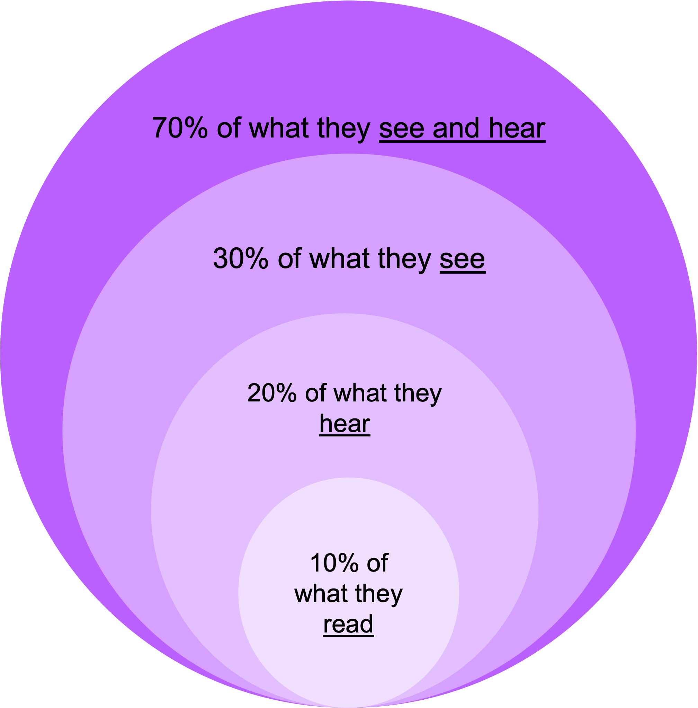

%% Presentations: Working with Slides %%

In this topic, we will focus on strategies in visual presentation that can enhance the ways in which your audience processes and retains information you give them.

# Visual storytelling

Think of your favourite childhood picture book. How do the words connect to the images?

"Shh! Little Mouse", by Pamela Allen, is a great example of how picture books use visual strategies to enhance literacy. Look at some of the opening pages (available [here on Amazon](https://www.amazon.com.au/Shhh-Little-Mouse-Pamela-Allen/dp/0143503677)) and observe how:

1. Most words are written to be spoken and heard, engaging key prosodic strategies that are needed for great presentations. Strategies used in the book include repetition, assonance, alliteration, rhyme, and balanced sentences. 

2. Key words are also written to be seen and read. This helps to build an association between what the listener hears and what is visualised phonetically as part of the image. 

3. Images underpin and draw the action of the story forwards (keeping the reader turning the page). The images illustrate vital information that is NOT conveyed in the words alone.

# How memorable is information received in different modes?

The use of visual technologies to support your presentation can add enormously to its effectiveness. Experts Patsy McCarthy and Caroline Hatcher quote a study by the Wharton Business School which found that people remember the following portions of information in various modes. 

(Patsy McCarthy and Caroline Hatcher, 2002, Presentation Skills, p. 167)

Picture books work to create webs of meaning. Story is used to entice young readers into the world of meaning-making, and to experience the building blocks of good communication. 

Picture books might feel like 'kidstuff', but the same relationship between words and images should be operating in your presentation slides. Presentation expert Andy Goodman explains that audiences have two channels for processing information: the visual and the auditory.

> “These channels work simultaneously, so audience members are perfectly capable of looking at a slide, listening to the presenter, and making sense from both streams of information. These same people can run into trouble, however, when they have too much information to process at one time." - See this [presentation by Andy Goodman](https://www.poppov.org/wp-content/uploads/2018/03/WhyBadPresentations.pdf) (2006: 51)

Your listeners will be engaged most when webs of meaning between the auditory and the visual information channels are working together, drawing them into the narrative and inviting them to create connections and inferences. 

If we think about how picture books model how these two channels operate, we can say that each channel is equally responsible for telling part of the story, and the pleasure of reading exists in interpreting them together.

# Avoiding "Death by PowerPoint"

Most presentation spaces will have projection equipment as standard, so incorporating images, video or sound through PowerPoint, Keynote or other software is relatively easy. In fact, it has become so standard that we have the colloquial expression “Death by PowerPoint,” which refers to ubiquitous, dull presentations that rely too much on information on slides, and don’t illuminate stories and ideas.

# When should you use visual aids and how much? 

Consider that if you want your audience to remember 70% of the presentation, you need to allow them to both see and hear information that you are presenting. This means you want the images you use and the talking you do to complement one another and not compete with one another.

Consider how the following strategies can help you rethink your use of visual media in presentations.

# Show, don’t tell 

Slides should never simply replicate the words that are being spoken. In fact, if you use your slides like a teleprompter for your speech, then your audience will likely tune out from listening because your slides are doing that work.  

When you read your slides verbatim, you become redundant. 

Consider instead how your choice of image might amplify, qualify, expand upon, humorise, distil or even subvert the spoken information. Just like picture books, images must add or do something additional to what is being said.

You can think of this as using images to appeal to the audience’s sense of logos or pathos.

**Logos (reason): Complex statistics or figures** 

These are usually too much for a listener to take in and make sense of when heard once in the context of a presentation. Representing details like this in a graph, list or table can really help your audience to visualise the patterns of the information and through this, grasp your key point.

**Pathos (emotion): An image is worth a thousand words**

Sometimes, you can find an illustration or cartoon that, through humour, simplifies a complex idea into a memorable image. Or you might find one that uses emotion to really underscore an important point.

# Let's look at some examples

Consider the following examples of logos and pathos in images as if they were to be used in a hypothetical speech titled ‘The Importance of Children using Sunscreen’. 

- How might each of them appeal to Pathos and Logos?
- What do you notice about the different visual approaches in terms of their persuasiveness? 
- What do you find the most efficient to interpret and also the most impressionable?

**Example 1: Skin Cancer Facts** 

Visit this [Spotscreen website](https://www.spotscreen.com.au/info-centre/skin-cancer-information/skin-cancer-facts/) and consider how the infographic entitled "Skin Cancer Facts" might be used in the hypothetical presentation entitled ‘The Importance of Children using Sunscreen’.

**Example 2: Cancer data in Australia**

Now visit this [Australian Institute of Health and Welfare](https://www.aihw.gov.au/reports/cancer/cancer-data-in-australia/contents/cancer-data-commentaries/risk-of-melanoma) website and consider how the varios graphs on the page might be used in the same hypothetical presentation.

**Example 3: What happens to your skin when you get sunburnt?**

Finally, visit this [Cancer Council](https://www.cancer.org.au/blog/what-happens-to-your-skin-when-you-get-sunburnt) website and consider how the two photographs on the page might be used in the same hypothetical presentation. 

- What do you notice about how it communicates persuasively, but differently, to the graphics in the first three example? 
- Does it remain in your memory more securely? 
- Does it provide adequate evidence and information?

# Reflection

In the first two examples, the graphics index important points about the use of sunscreen and the risks associated with not using sunscreen.

In example 3, however, a photographic image of sunburn indexes the physical process of increasing skin cancer risk. 

**Example 1** illustrates a lot of connected facts (6 in total) in order to persuade readers to use sunscreen. The visual design is colourful and appealing. Is there too much information on this slide in order for you to process it effectively?

**Example 2** illustrates one statistic and appeals to a more technical readership or audience. Interestingly, this graphic offers a persuasive technique counter to examples 1 and 2: rather than persuade via a ‘scare’ campaign, it persuades by showing reduction in mortality rates over time because of enhanced sun awareness practices.

**Example 3** is affective (i.e., appealing to emotions and sensations because it kinaesthetically appeals to an audience’s bodily experience). Sunburn is something we most likely have all ‘felt’ at some point in our lives. It persuades by drawing instant connection between the experiential palette of the audience and that which is being shown.

# Storyboard your ideas

Now it’s your turn. But before you have a go, consider this final point:   

- Your slide design is not only concerned with adding or amplifying meaning, but also with creating rhythm. 

Images contribute to the sequencing of information, enticing listeners through to the end of an idea by producing a ‘frission’ of concepts and cognitive modes. Pauses and pacing make space for your listeners to process and reflect. Images not only evidence but punctuate and temporalise your presentation. 

Great speakers understand that images can underpin the timing, as well as meaning, of a speech.

# Have a go!

- If you had to run your presentation ONLY with visual images (no words or speech!) how would you do it?  
- When do you wish to appeal to the audience’s logos (their sense of reason)?
- When do you wish to appeal to the audience’s pathos (their sense of emotion)?

You have 5 minutes to collect and select up to 10 images that would best illustrate the key points in your presentation. Set your timer – and go! 

You can storyboard by sourcing images online or just diagramming the kinds of images/graphics you would ideally find.

**Once you have collected your images, put them in order.**

Consider this structure:

- **Use 2-3 images for set up**: These images should illustrate presence, occasion and address – the stakes or ‘why’ of the problem as well as anticipating the solution). This should take up 3-5 mins of your presentation, roughly 15% of total speaking time.

- **Use 4-6 images to illustrate each a core / anchoring point in your argument**: This should take up 12-15 mins of your presentation, roughly 70% of total speaking time.

- **Use 1-3 images to bring home your concluding points**: This should take up 2 mins of your presentation, roughly 5% of total speaking time.
  
Images you select as part of this activity can include charts and diagrams but can also include sketches and photos. Be sure to use Creative Commons images to make sure you are not breaking copyright laws. 

Storyboarding before you have begun writing can be an interesting way to get the ideas flowing and bed down your structure. It can provide a helpful architecture that, when you have written your speech, you can further adjust or amend.

**When presenting, remember:**

- Don’t read your slides. 
- Talk to the slides. 
- Let the images do the talking. 
- Allow space for your audience to digest the image by pausing and then summarising what is most significant about it.