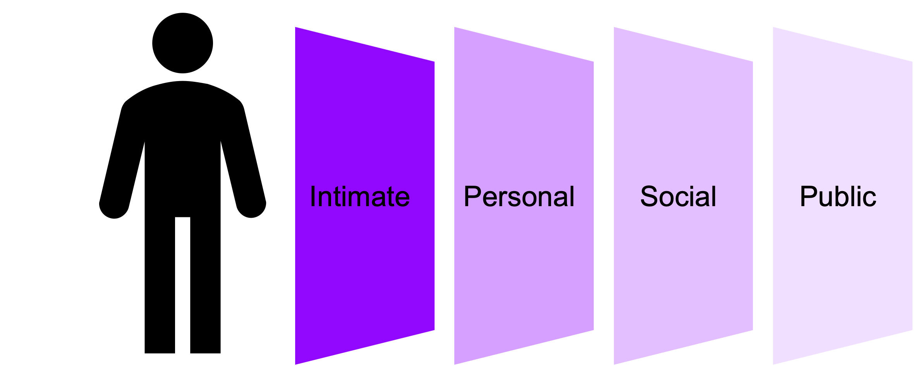
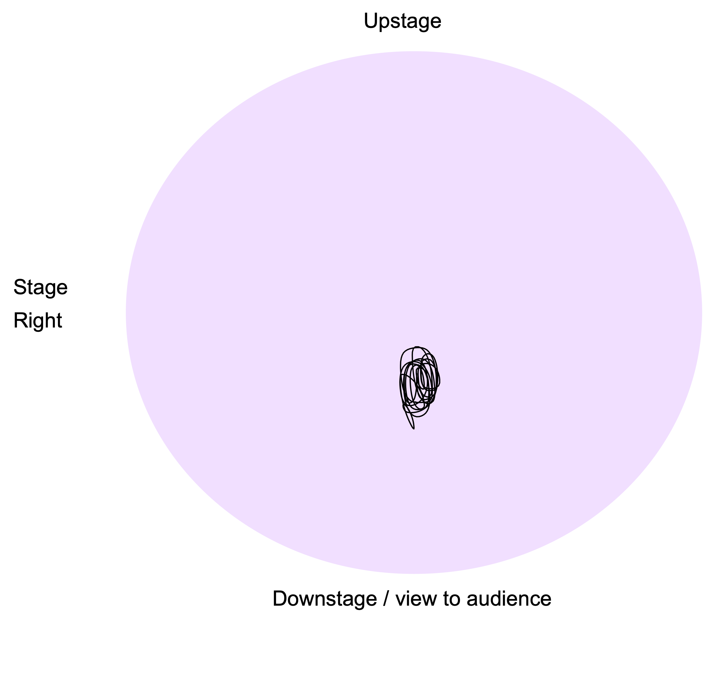
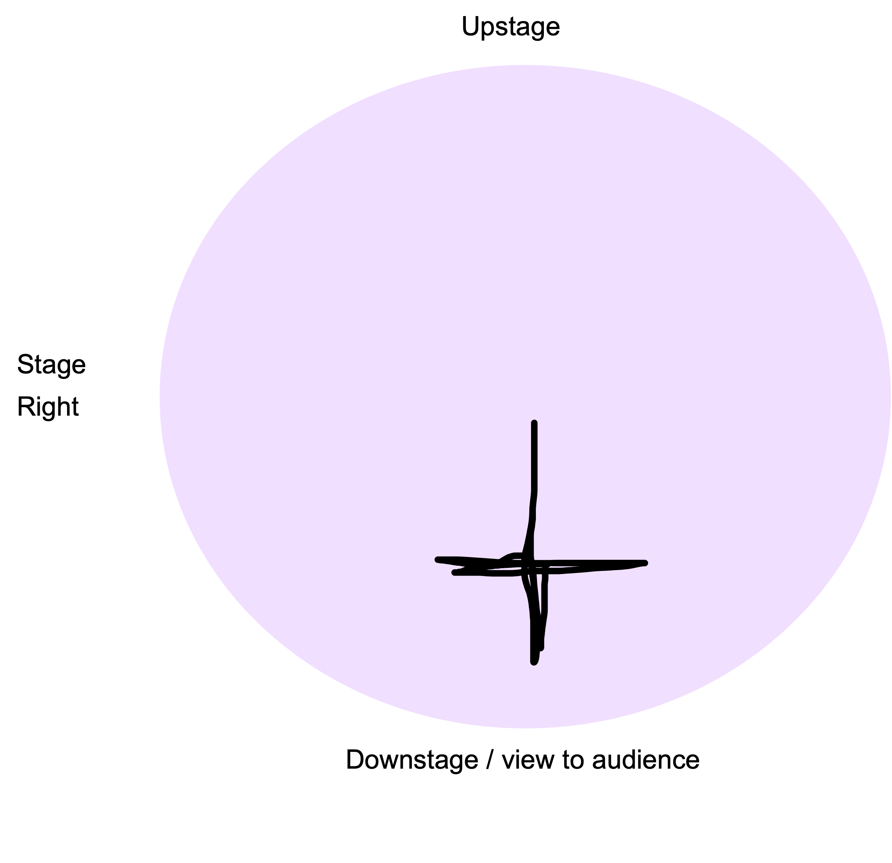

%% Presentations: Owning the Room %%

In this topic, we will focus on how how spatial proxemics, both online and in person, can enhance the dynamics of persuasive communication.

# Space communicates

We all know how uncomfortable it can feel to experience, or to view, situations where we sense that personal pace has been violated. But we possibly don’t know that this means we are well rehearsed in reading, as well as employing, the social dynamics of space in different settings. 

Proxemics is the study of the human use of space, and particularly, the impact spatial relationships have on behaviour, communication and interaction. Anthropologist Edward T. Hall spent time in the 1950s mapping the cultural specifics of space to produce schemas.

The following graphic illustrates and example of a proxemics schema and each of the distances are described in the following paragraphs. 

- **Intimate**: This space is reserved for people who are emotionally close to you. In this space, you should stand two fists away from people. 
- **Personal**: This is reserved for people during friendly gatherings. In this space, you should stand one handshake away from people.
- **Social**: When you dont know people well, you would stand two arm lengths away.
- **Public**: When you are addressing a big group, you would stand approximately 3.6m away from people

Spaces instruct and inform how bodies can act and create meanings about us in relation to others. Different cultures show us this. What is acceptable social distance in one culture might be considered impolite or inappropriate in another. Pandemics, of course, change up the rules about acceptable use of space again.

A key aspect that will underpin the persuasive dynamics of your presentation is how you interact with the space in which it takes place.

Commanding presenters make careful choices about their use of space to:

- Aid the clear communication of their message
- Model control of their material
- Encourage connection with, and buy-in, of listeners in the room
- Demonstrate ease and comfort of self
- Animate and visualise thinking processes and ideas.

# Reading space

Let's look at some examples of how proxemics is used by presenters. You might remember watching these videos in the previous topic as we reviewed prosody. We are now going to watch the first two minutes of each video again with the sound and captions off. Here's what you need to do:

1. Before you watch, draw a circle on a piece of paper. 
1. Imagine that the circle is a birds eye view of the presenters stage. 
1. Mark the audience and the slideshow onto your stage map so that you can imagine which way the presenter will be facing. In stage management lingo, spatial parameters of a stage are called centre stage, stage right, stage left, downstage and upstage.
1. Then, watch the first two minutes of each video with sound and caption off. 
1. As you watch the videos, trace a continuous line onto your circular stage map that matches where the presenters bodies travel on the presentation stage.

# Amal Kassir

<iframe loading="lazy" width="638" height="359" src="https://www.youtube.com/embed/UIAm1g_Vgn0" title="The Muslim on the airplane | Amal Kassir | TEDxMileHighWomen" frameborder="0" allow="accelerometer; autoplay; clipboard-write; encrypted-media; gyroscope; picture-in-picture" allowfullscreen></iframe>

[[[ Reveal Kassir's spatial map >>>

Did your spatial map of Kassir's movements look something like this?

]]]

# Jennifer Granholm

<iframe loading="lazy" src="https://embed.ted.com/talks/lang/en/jennifer_granholm_a_clean_energy_proposal_race_to_the_top" width="854" height="480" style="position:absolute;left:0;top:0;width:100%;height:100%" frameborder="0" scrolling="no" allowfullscreen></iframe>

[[[ Reveal Granholm's spatial map >>>

Did your spatial map of Granholm's movements look something like this?

]]]

# A summary of Granholm's speech

If we bring this concept of spatial mapping together with what we learned in the prosody topic you will result the following correlations:

[[[**Excerpt 1**: "I was introduced as the former Governor of Michigan but I’m actually a scientist." >>>
- Rhetorical mode: Presence (who)
- Prosody: 
    * Pauses for reflection / connection
    * Voice is melodic – large vocal range while sitting in a lower register
- Body language: 
    * Power pose, strong upright posture, arms behind back (non-threatening)
    * Leaning in to audience (connection, subservience)
- Spatial choices: 
    * Strides forward to centre stage
    * Stands centre stage
    * Moves stage right, stands]]]

[[[**Excerpt 2**: "A political scientist .. and my laboratory was the laboratory of democracy. Like any good scientist I was experimenting with policy about what would achieve the greatest good for the greatest number." >>>
- Rhetorical mode: Ethos
- Prosody: 
    * Alliteration ‘g’
    * Epithet ‘greatest good’
- Body language
    * Animated hand gestures waist height, reaching forwards – power sphere
    * Continuous eye contact ranging across the room – reaching different levels
- Spatial choices: 
    * Moves stage left, stands
]]]

[[[**Excerpt 3**: "But there were three problems that I could not solve. And I want to share with you those problems. But most importantly I think I figured out a proposal for the solution." >>>
- Rhetorical mode: Occasion (why)
- Body language: 
    * Fingers count out each point – 1, 2, 3
- Spatial choices: 
    * Moves in towards audience (downstage), centre stage, stands]]]

[[[**Excerpt 4**: "The first enigma… let me share with you some data… I was elected in 2002…">>>
- Rhetorical mode: Pathos and Logos - ‘Data with a soul'
- Spatial choices: 
    * Moves stage left, stands
]]]

# Get off your soapbox

Have you ever heard the phrase ‘get off your soap box’? The soap box was historically used for impromptu acts of speaking in public places. 

While the phrase today holds connotations of being impassioned or possibly even too opinionated, the soap box itself is an object that facilitates speech and expresses spatial functionality. The soapbox enabled speakers to: 

1. Be seen
1. Be heard

And the rules of the soapbox still apply today. Let's review some examples that convey just how important effective use of space is, both in person and online. 

**Example 1: Real life audience and the issue of the lectern**

Go to this [blog post](https://www.melsherwood.com/blogposts/2016/09/06/8-reasons-why-you-should-stop-presenting-from-behind-a-lectern) by Mel Sherwood and look at the first image with the caption "On stage behind lectern at RBS". Can you see the problem with the presenters presence? Can you image how standing on a soapbox would help the presenter to be seen and heard more effectively?

**Example 2: Online audience and the issue of the webcam** 

Go to this [blog post by Proud Business Productions](https://www.proudbusinessproductions.com/blog/2020/4/23/how-can-i-make-my-make-my-zoom-meetings-look-better) and see the various examples of camera positioning of a presenter's webcam for an online audience. Can you see the problem with the presenters presence? Perhaps this helps illustrate the importance of webcam positioning and how the soapbox idiom can be reimagined in the modern world.

# Rules of spatial awareness

Read the key rules of using spatial awareness to your advantage when you are presenting to an audience.

# Rule 1: Be seen and be heard

Spatial choices are first and foremost practical. Ineffective use of space communicates a lack of command, of self and of material. Whether you are presenting in an intimate boardroom, a large amphitheatre or on zoom, you must make swift choices about how you will be seen and heard. 

Often this is challenged by the unfamiliarity of a space and the lack of time you have to become used to it.

**Steps you should take to own the physical space**

1. Evaluate
- Is the space designed or set up for presentation? 
- Does it have a stage, a lectern or a table or seating configuration indicating where the speaker should stand?

2. Decide 
- Is this the right area for you to use? 
- Does it present challenges? (ie if you are shorter in height, then a lectern will block your energy and disconnect you from your audience). Interestingly, all TED-affiliated presentations forbid the use of the lectern. Even if it makes the presenter feel ‘safe’ it blocks connection and eye contact.

3. Delimit 
- Consider the image of a ‘TED’ circle, as indicated above in the examples from Kassir and Granholm. The TED circle is a branding exercise but also a functional delimiter of usable space: presenters are not to move outside of it.
- When you are presenting, draw an imaginary circle on the floor, modified to fit inside your presentation space. Use that shape to delimit in advance where you will stand and move. This will help to you feel in control, and when you feel in control, you also look in control.

4. Anticipate the audio conditions
- Will the room require you to project vocally? Does it present acoustic challenges? - Where relevant, test and set the correct height and sound levels of a microphone before you begin.

# Rule 2: Spatial choices are dynamising

Refer back to the spatial maps of Kassir and Granholm. 

Notice how Kassir remained rooted to one spot in the centre of the TED circle, while her arms and face were highly animated. Contrastingly, Granholm used the space by moving from side to side and in towards the audience and out again. 

Granholm did not move frantically or move so much that she distracted from her message. In fact, if you look closely you will see that Granholm used space to help her audience understand and remember her message. Her movement in space punctuated her message. Her movement in space spatialised it.

When planning your presentation you can plan your use of space by using either the circle diagram, or the column approach, as above. The more planned you are, the more your audience will feel confident in your message. 

Choose to move with purpose, and in between key points, rather than when you are speaking. Choose to move in and out (or downstage and upstage) as a way to show your audience you are interested in them. Note how Granholm moves in towards her audience when she says: ‘I want to share with you…’.

# Rule 3: Create your zoom space

The COVID pandemic has opened the world to digital presentations in a way never experienced before. But presenting on Zoom is not the same as presenting in Real Life. Indeed, presenting on Zoom has its own special rule book but the same central tenets apply:

- Be Seen 
- Be Heard
- Dynamise your Space

Here are some guidelines to creating your zoom space: 

**Entreat with visual story** 

Consider that in online contexts your background communicates a visual story. You can create a visual background that complements your brand or message. Consider how both Megan Markle and Kimberly Guilfoyle create effective colour palettes that enhance their messages.

**Frame yourself**

Just like the TED circle, a screen is also a frame. Viewers want to see your face clearly, and in proportion to the frame. Try to leave 1-2 inches of space above your head as it appears in the frame. Megan Markle does this well.

**Eye contact is not eye contact**

Eye contact is not eye contact on Zoom. It is not looking at yourself nor at your peers. As above, it happens when you look at the camera. Consider how you need to be positioned so that your eyes can find a direct line with the computer’s camera. Prop up your computer so that you can look directly at (not up nor down into) its camera.

**Light yourself**

Your face needs to be lit. If lighting comes from behind you, your face will be dark on screen. If you don’t have a window in front of you, consider setting up a lamp. Make sure to close any blinds that are behind you.

**Energy**

Even if your listeners only see your face and upper torso, make the choice to stand if you can. Standing energises your body and allows you voice to resonate by engaging your diaphragm more effectively. To do this you’ll need to raise the height of your computer from your desk.

**Connect**

Presenting on Zoom can feel strange as you have different tools are your disposal for remembering your text. When working with slides, talk to, don’t read them. And keep a print out handy if you need to follow up on the detail. If you are not using slides but still need to read your text, you can try a free online teleprompter such as [Cue Prompter](https://cueprompter.com/) or [ZaCue](https://zacue.com/). But practice with them first as they can present tricky issues with speed too.

# Knowledge check

Take a moment to review what you have learned in this topic before we move on.

[[[ Q1. According to Proxemics, how far should you stand from people in a public space? >>>
Over 3.6m away.
]]]

[[[ Q2. According to Proxemics, how far should you stand from people in a personal space? >>>
One handshake away.
]]]

[[[ Q3. According to Proxemics, how far should you stand from people in a social space? >>>
About two arm lengths away.
]]]

[[[ Q4. In the first rule of spatial awareness, what are the four steps you should take to own your physical space? >>>
- Evaluate the presentation setting
- Decide which area is best for you
- Delimit your space by staying within a designated zone
- Anticipate the audio conditions
]]]